<style>
    h1,h2,h3,h4,h5,h6, ol, ul, p {
        direction: rtl;
        text-align: right;
    }
</style>

# تمرین اول آزمایشگاه پایگاه داده

گروه شماره ۳

---

## پاسخ قسمت الف

### ویژگی های موجودیت لپ تاپ

- مدل
- برند
- قیمت
- مقدار RAM (GB)
- مقدار حافظه داخلی (GB)
- نوع خافظه داخلی (HDD, SSD)
- مدل پردازنده گرافیکی
- اندازه صفحه نمایش (inch)
- مدل پردازنده
- وزن (g)

### ویژگی های موجودیت مانیتور

- برند
- مدل
- سایز (inch)
- قیمت
- رزولیشن
- نوع صفحه (LED, LCD, QLED, ...)
- نرخ بروزرسانی تصویر
- سرعت پاسخ

### ویزگی های موجودیت هارددیسک

- برند
- مدل
- قیمت
- فناوری اتصال
- اینترفیس
- ظرفیت (GB)
- وزن
- نوع (HDD, SSD)

---

## پاسخ قسمت ب

ابتدا روی `Databases` کلیک راست میکنیم و بر روی گزینه ی `Create` و `Database` کلیک میکنیم.

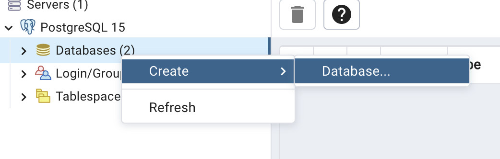

سپس در پنجره ی باز شده اسم دیتابیس را مینویسیم و بر روی دکمه ی `Save` کلیک میکنیم.

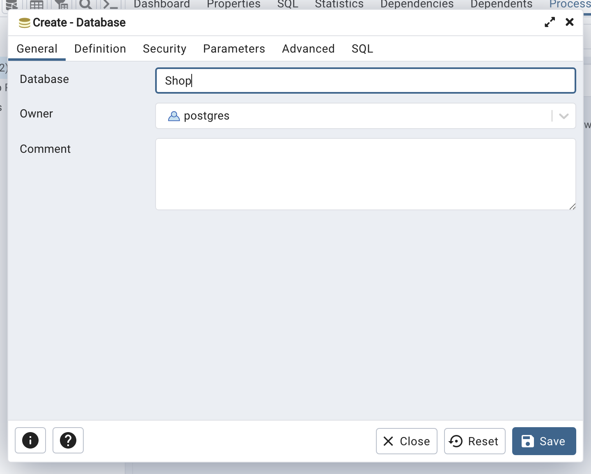

حال میتوانیم دیتابیسی که ساخته شده را در قسمت `Databases` مشاهده کنیم.

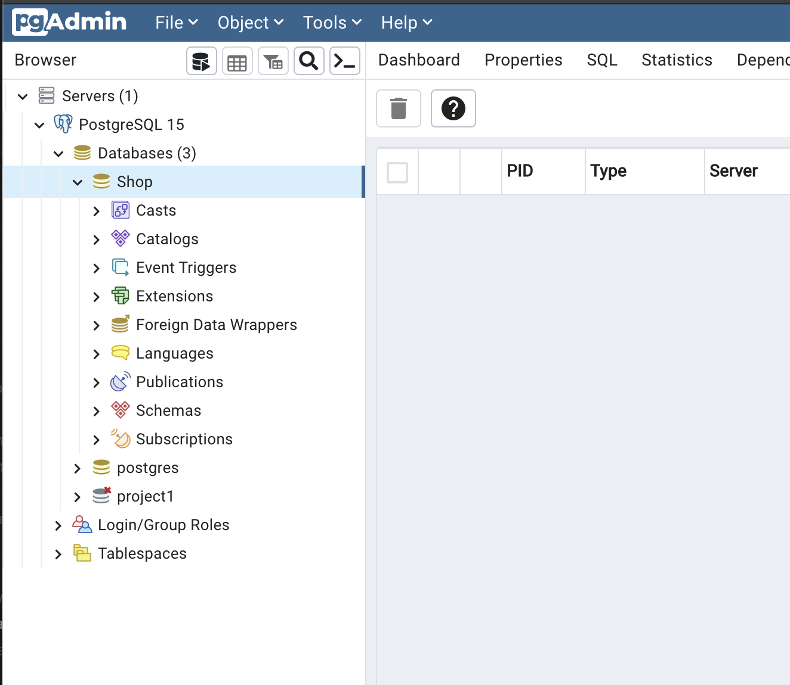

برای ساخت دیتابیس میتوانیم از دستور زیر نیز استفاده کنیم:

```sql
CREATE DATABASE "Shop";
```

---

## پاسخ قسمت ج

برای جدول `hard_disk` نیاز به یک ستون `connectivity_technology` داریم که برای نوع آن یک `enum` تعریف میکنیم.
برای تعریف آن میتوانیم از دستور زیر استفاده کنیم:

```sql
CREATE TYPE connectivity_technology AS ENUM (
 'eSATA',
 'Ethernet',
 'Firewire',
 'SATA',
 'Thunderbolt',
 'USB'
);
```

بعد از زدن دکمه ی `excute` میتوانیم مشاهده کنیم که `enum` جدیدی به نام `connectivity_technology` ایجاد شده است.

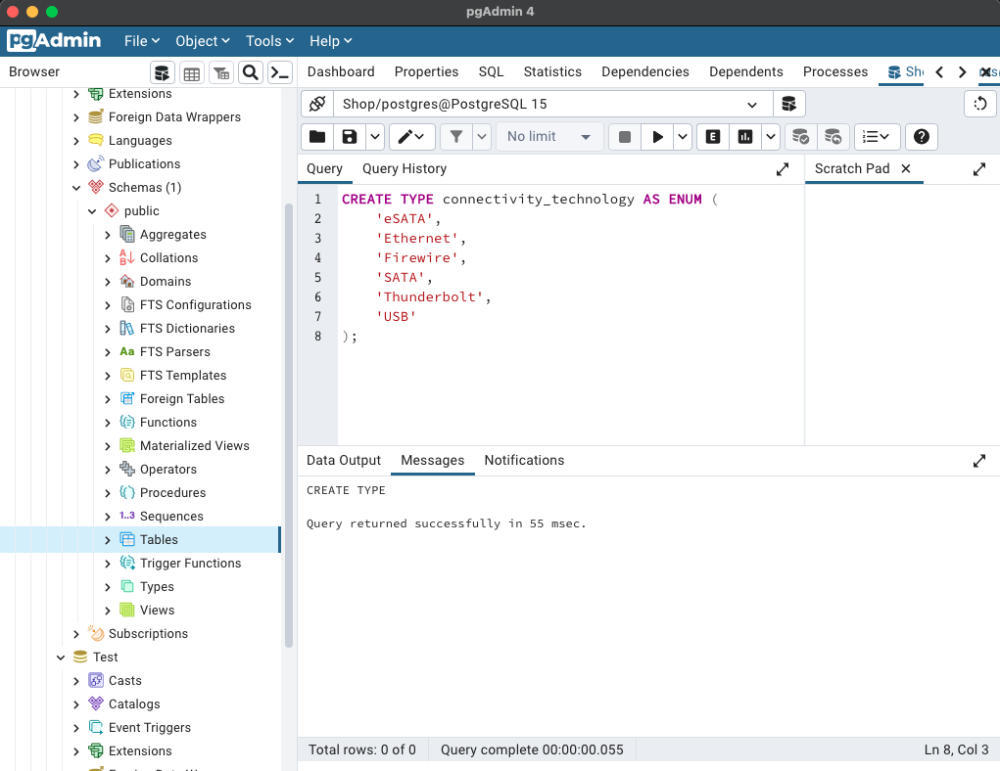
در قسمت `Types` نیز قابل مشاهده است.
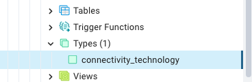

برای ستون `interface` نیز نیاز به ساختن یک `type` جدید هستیم و مانند مرحله ی قبل عمل میکنیم:

```sql
CREATE TYPE hard_disk_interface AS ENUM (
 'EIDE',
 'Fiber Channel',
 'PATA',
 'PCIe x4',
 'PCIe x16',
 'SAS',
 'SATA I',
 'SATA II',
 'SATA III',
 'Thunderbolt',
 'USB'
);

```

بعد از کلیک کردن دکمه ی `excute` میتوانیم در قسمت `Types` ببینیم که `type` جدیدی به نام `hard_disk_interface` ایجاد شده است.

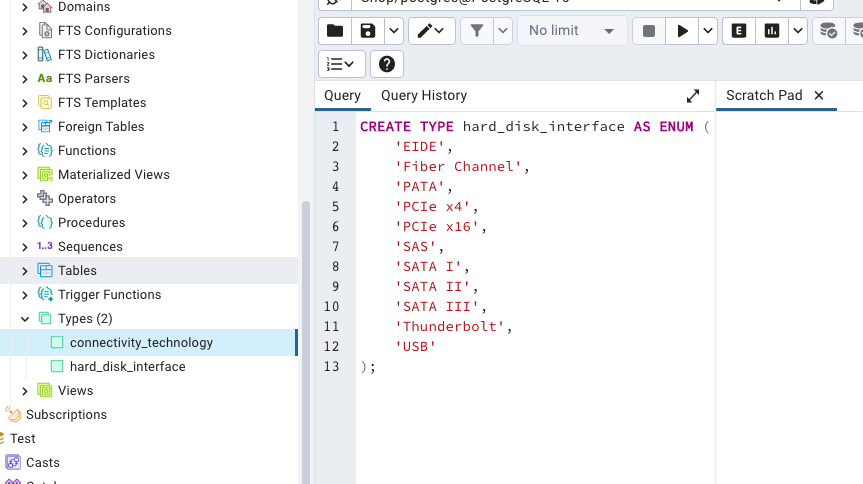

و همین طور برای ستون `type`:
(انواع گوناگونی وجود دارد اما ما فقط `SSD` و `HDD` را در نظر میگیریم)

```sql
CREATE TYPE hard_disk_type AS ENUM ('SSD', 'HDD');
```

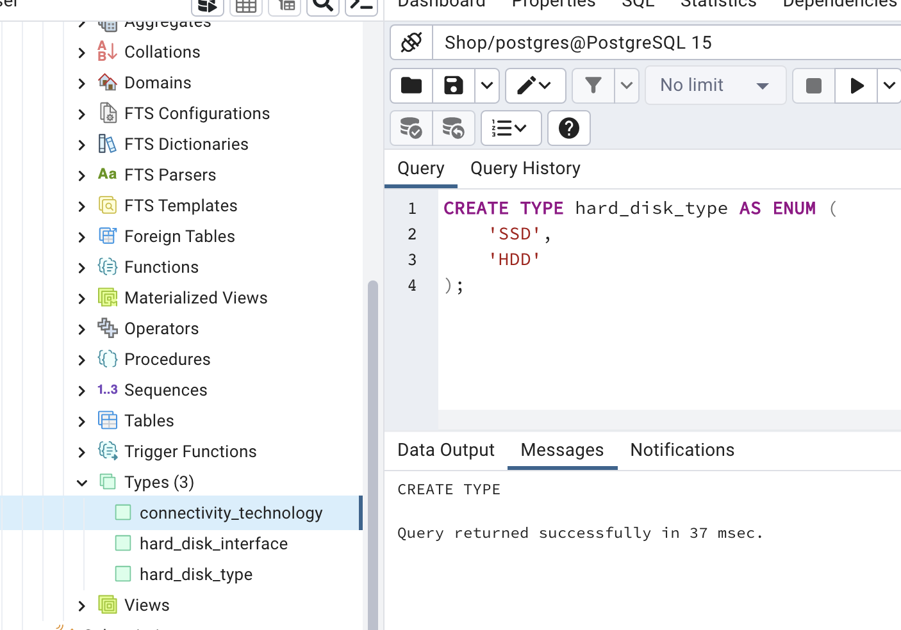

حال میتوانیم جدول `hard_disk` را با دستور زیر ساخته و مقادیر مورد نیاز را به آن اضافه کنیم:

```sql
CREATE TABLE hard_disk (
 id serial PRIMARY KEY,
 brand varchar(25),
 model varchar(25),
 price integer CHECK (price > 0),
 capacity integer CHECK (capacity > 0),
 connectivity_technology connectivity_technology,
 interface hard_disk_interface,
 wieght smallint CHECK (wieght > 0),
 type hard_disk_type
);
```


قبل از ساخت جدول `monitor` نیاز است که دو `type` جدید به نام `resolution` و `monitor_display_type` ایجاد کنیم:

```sql
CREATE TYPE monitor_display_type AS ENUM (
 'CRT',
 'LED',
 'OLED',
 'QLED',
 'LCD'
);
```

```sql
CREATE TYPE resolution AS ENUM (
 '4K',
 'QHD',
 'FHD',
 'SXGA',
 'SVGA',
 'HD',
 'VGA'
);
```

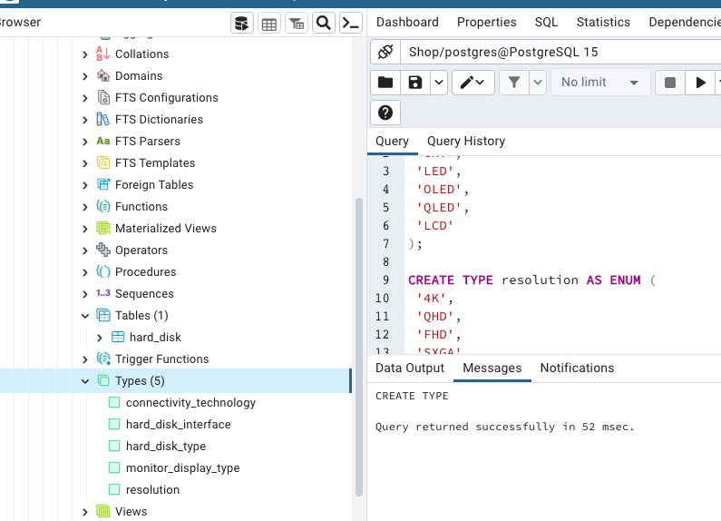

برای ساخت جدول `monitor` دستور زیر را وارد میکنیم:

```sql
CREATE TABLE monitor (
 id serial PRIMARY KEY,
 brand varchar(25),
 model varchar(25),
 price integer CHECK (price > 0),
 display_type monitor_display_type,
 display_size smallint CHECK (display_size > 0),
 refresh_rate smallint CHECK (refresh_rate > 0),
 response_time smallint CHECK (response_time > 0),
 resolution resolution
);
```

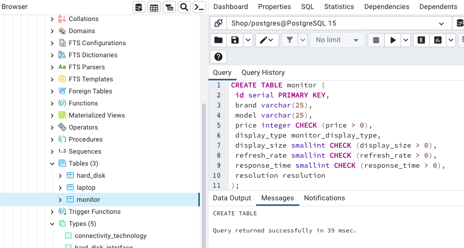

برای ساخت جدول `laptop` دستور زیر را وارد میکنیم:

```sql
CREATE TABLE laptop (
 id serial PRIMARY KEY,
 brand varchar(25),
 model varchar(25),
 price integer CHECK (price > 0),
 screen_size smallint CHECK (screen_size > 0),
 ram smallint CHECK (ram > 0),
 hard_disk_size smallint CHECK (hard_disk_size > 0),
 hard_disk_type hard_disk_type,
 cpu_model varchar(25),
 graphics_coprocessor varchar(25),
 weight smallint CHECK (weight > 0)
);
```

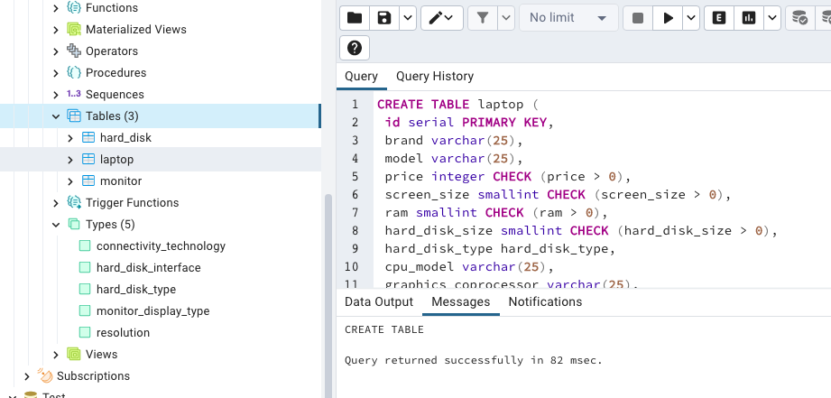

---

## پاسخ قسمت د

در این قسمت باید از دستور `INSERT` برای اضافه کردن مقادیر به جدول ها استفاده کنیم.

برای اضافه کردن مقادیر به جدول `hard_disk` دستور زیر را وارد میکنیم:

```sql
INSERT INTO hard_disk (brand, model, price, capacity, connectivity_technology, interface, wieght, type) VALUES ('Seagate', 'STGX2000400', 61, 2048, 'USB', 'USB', 500, 'HDD');
```

```sql
INSERT INTO hard_disk (brand, model, price, capacity, connectivity_technology, interface, wieght, type) VALUES ('Western', 'WD20EZBX', 74, 2048, 'SATA', 'SATA III', 660, 'SSD');
```


برای اضافه کردن مقادیر به جدول `monitor` دستور زیر را وارد میکنیم:

```sql
INSERT INTO monitor (brand, model, price, display_type, display_size, refresh_rate, response_time, resolution) VALUES ('Sceptre', 'E248W-19203R', 119, 'LED', 24, 60, 3, 'FHD');
```

```sql
INSERT INTO monitor (brand, model, price, display_type, display_size, refresh_rate, response_time, resolution) VALUES ('LG', '24MP400-B', 139, 'QLED', 24, 120, 2, '4K');
```

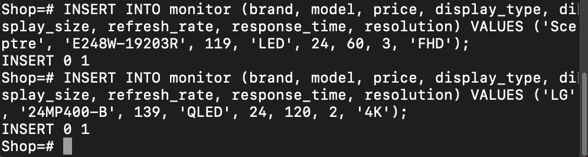

برای اضافه کردن مقادیر به جدول `laptop` دستور زیر را وارد میکنیم:

```sql
INSERT INTO laptop (brand, model, price, screen_size, ram, hard_disk_size, hard_disk_type, cpu_model, graphics_coprocessor, weight) VALUES ('HP', '15s-eq0001au', 599, 15, 8, 256, 'SSD', 'AMD Ryzen 3 3250U', 'AMD Radeon Graphics', 1.7);
```

```sql
INSERT INTO laptop (brand, model, price, screen_size, ram, hard_disk_size, hard_disk_type, cpu_model, graphics_coprocessor, weight) VALUES ('Lenovo', 'IdeaPad 3 15ADA05', 599, 15, 8, 256, 'SSD', 'AMD Ryzen 3 3250U', 'AMD Radeon Graphics', 1.8);
```

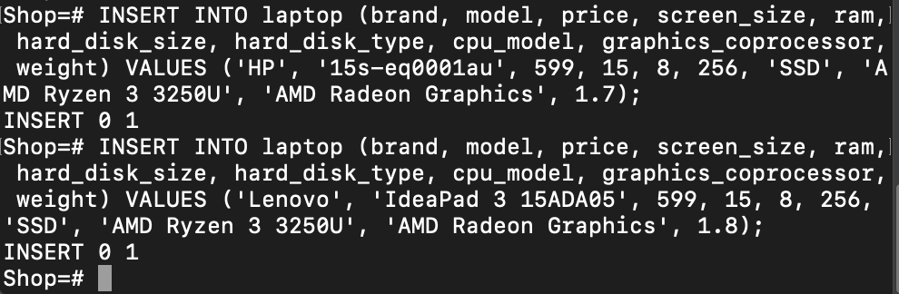

---

## پاسخ قسمت ه

برای جدول `hard_disk` نمیتوان قیمت، ظرفیت و وزن کمتر از صفر داد. حتما باید بزرگتر از صفر باشد.
یکی از فیلد ها را صفر یا منفی قرار میدهیم تا نتیجه را ببینیم. به طور مثال قیمت را صفر قرار میدهیم:

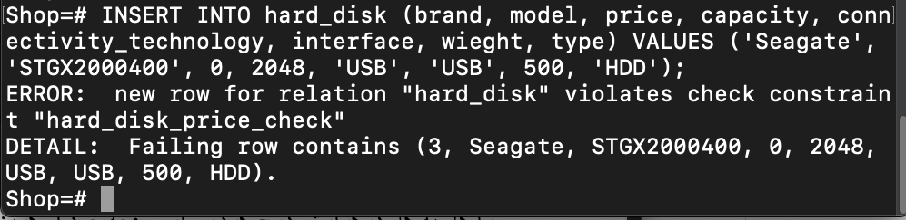

برای جدول `monitor` نمیتوان قیمت، اندازه صفحه نمایش، رفرش ریت، زمان پاسخگویی و وزن را کمتر از صفر داد. حتما باید بزرگتر از صفر باشد.
یکی از فیلد ها را صفر یا منفی قرار میدهیم تا نتیجه را ببینیم. به طور مثال زمان پاسگویی را منفی قرار میدهیم:

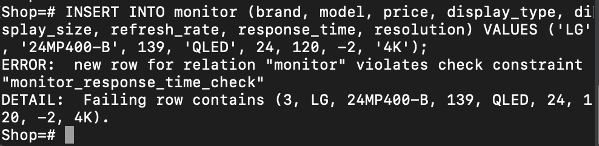

برای جدول `laptop` نیز مشابه دیگر جداول، نمیتوان قیمت، سایز صفحه، مقدار رم، مقدار حافظه داخلی و وزن را کوچکتر مساوی صفر قرار داد:

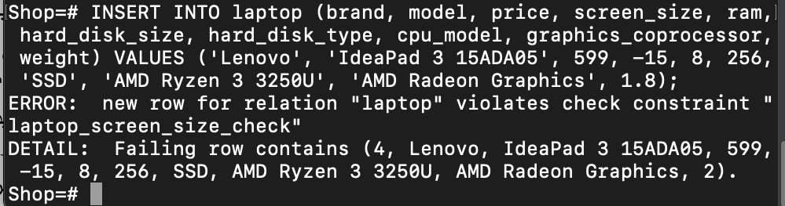

---

## پاسخ قسمت ن

برای نمایش جدول `hard_disk` میتوانیم از دستور زیر استفاده کنیم:

```sql
SELECT * FROM hard_disk;
```

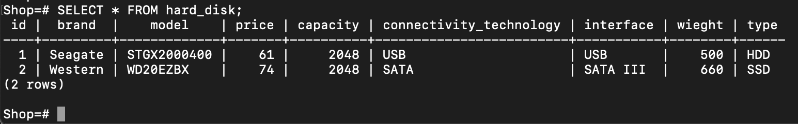

برای جداول `monitor` و `laptop` نیز به همین صورت:

```sql
SELECT * FROM monitor;
```

```sql
SELECT * FROM laptop;
```

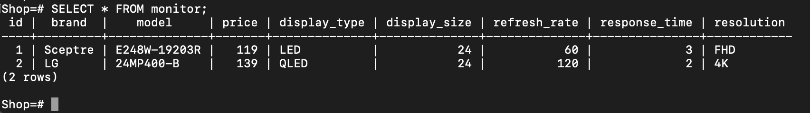
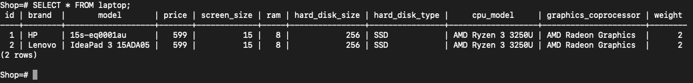
