# تمرین اول آزمایشگاه پایگاه داده

## الف

### موجودیت مسکن

#### مشخصات مسکن

- شناسه مسکن
  - نوع: عدد صحیح
  - مقدار پیش فرض: اتوماتیک
  - مقدار مجاز: یکتا
  - primary key
- شناسه مالک
  - نوع: عدد صحیح
  - foreign key
- وضعیت مسکن
  - نوع: Enum
  - مقدار مجاز: یکی از مقادیر زیر
    - فروش
    - اجاره
    - رهن و اجاره
- نوع مسکن
  - نوع: Enum
  - مقدار مجاز: یکی از مقادیر زیر
    - آپارتمان
    - ویلایی
    - زمین
    - مغازه
- متراژ مسکن
  - نوع: عدد اعشاری
  - مقدار مجاز: بزرگتر از 0
- تعداد خواب
  - نوع: عدد صحیح
  - مقدار مجاز: بزرگتر یا برابر با 0
- نوع کفپوش
  - نوع: Enum
  - مقدار مجاز: یکی از مقادیر زیر
    - سرامیک
    - لمینت
    - پارکت
- نوع سند
  - نوع: Enum
  - مقدار مجاز: یکی از مقادیر زیر
    - ملکیت اشتراکی
    - ملکیت خاص
- آدرس مسکن
  - نوع: رشته
  - مقدار مجاز: غیر خالی
- پلاک مسکن
  - نوع: عدد صحیح
  - مقدار مجاز: بزرگتر از 0
- قیمت مسکن
  - نوع: عدد اعشاری
  - مقدار مجاز: بزرگتر از 0
- اجاره مسکن
  - نوع: عدد اعشاری
  - مقدار مجاز: بزرگتر از 0 یا مقدار خالی
- توضیحات مسکن
  - نوع: رشته
- سال ساخت مسکن
  - نوع: عدد صحیح
  - مقدار مجاز: بزرگتر از 0

### موجودیت مالک

#### مشخصات مالک

- شناسه مالک
  - نوع: عدد صحیح
  - مقدار پیش فرض: اتوماتیک
  - مقدار مجاز: یکتا
  - primary key
- نام مالک
  - نوع: رشته
  - مقدار مجاز: غیر خالی
- نام خانوادگی مالک
  - نوع: رشته
  - مقدار مجاز: غیر خالی
- شماره تماس مالک
  - نوع: رشته
  - مقدار مجاز: غیر خالی

## ب

در محیط PgAdmin بر روی *Databases* راست کلیک کرده و `Create` و بعد `Database` را انتخاب میکنیم.
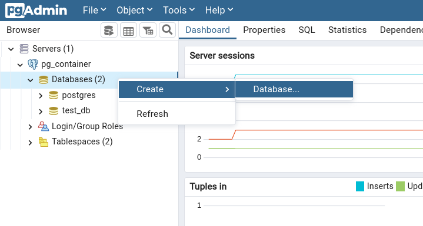
 سپس نام پایگاه داده را مشخص میکنیم و `Save` را انتخاب میکنیم.
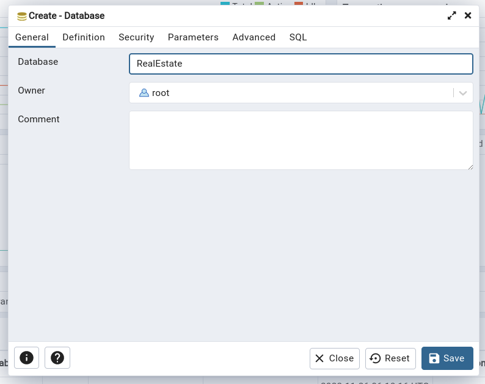
برای بررسی درستی ایجاد شدن پایگاه داده در محیط psql از دستور `\l` استفاده میکنیم.
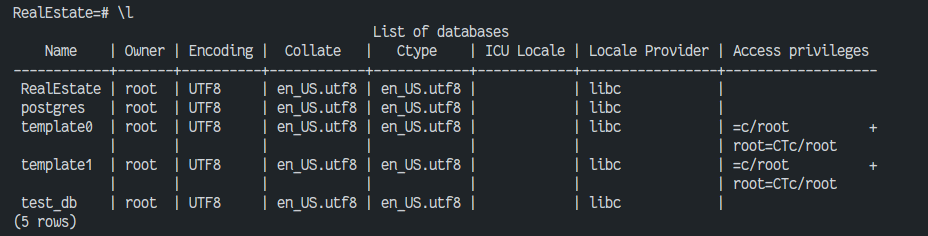
همچنین میتوانیم پایگاه داده را با دستور زیر ایجاد کنیم.

```sql
CREATE DATABASE 'RealEstate';
```

## ج

به دلیل رفرنس های موجود در جداول ما باید ابتدا جدول مالک را ایجاد کنیم و سپس جدول مسکن را ایجاد کنیم. برای ایجاد جدول مالک از محیط PgAdmin استفاده میکنیم.

ابتدا بر روی *Tables* راست کلیک کرده و `Create` و بعد `Table` را انتخاب میکنیم.
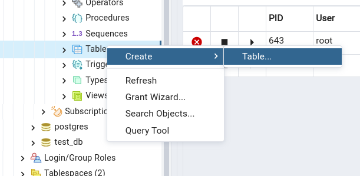

در قسمت `General` نام جدول را مشخص میکنیم و در قسمت `Columns` مشخصات جدول را مشخص میکنیم.
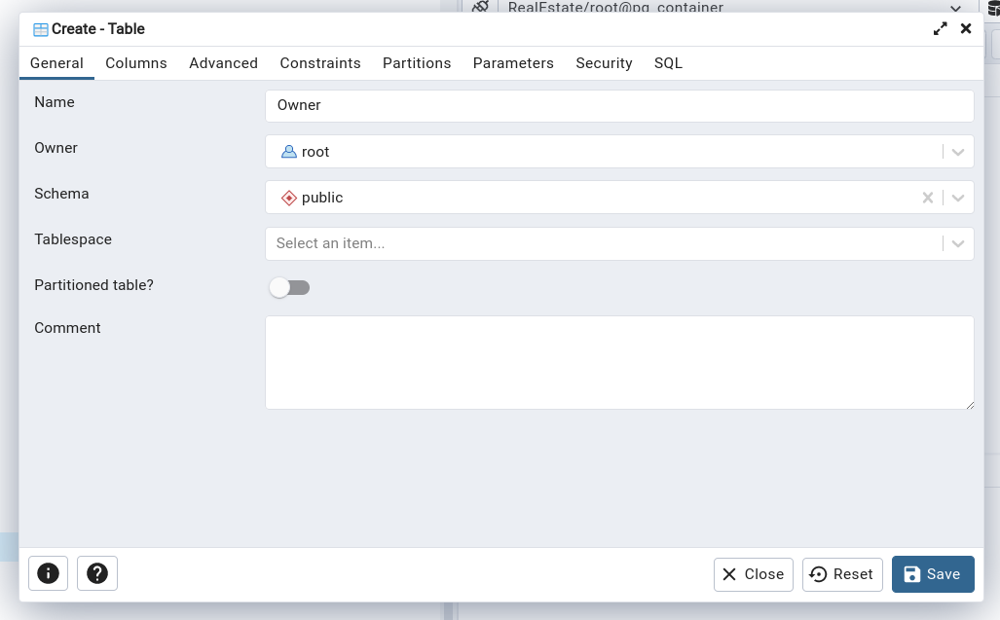
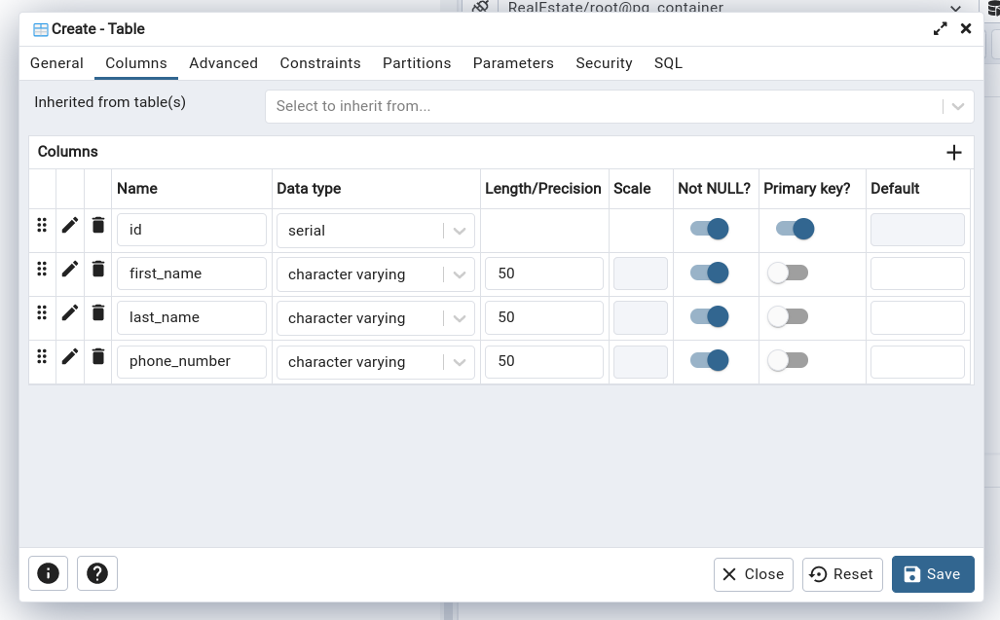

همچنین میتوانیم جدول را با دستور زیر ایجاد کنیم.

```sql
CREATE TABLE "Owner" (
    id SERIAL PRIMARY KEY,
    first_name VARCHAR(50) NOT NULL,
    last_name VARCHAR(50) NOT NULL,
    phone_number VARCHAR(50) NOT NULL
);
```

سپس جدول مسکن را ایجاد میکنیم. ابتدا ENUM های معرفی‌شده در موجودیت مسکن را ایجاد می‌کنیم.

```sql
CREATE TYPE PropertyStatus AS ENUM ('sale', 'rent', 'rent_sale');
CREATE TYPE FloorCoveringType AS ENUM ('ceramic', 'laminate', 'parquet');
CREATE TYPE DocumentType AS ENUM ('joint_ownership', 'private_ownership');
CREATE TYPE PropertyType AS ENUM ('apartment', 'villa', 'land', 'shop');
```

از محیط PgAdmin بررسی میکنیم که ENUM ها به درستی ایجاد شده اند.
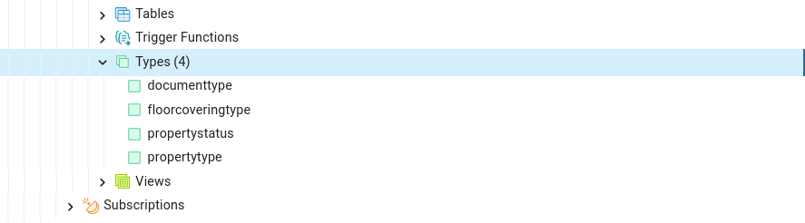

سپس برای ایجاد جدول مسکن در پایگاه داده میتوانیم از دستور زیر استفاده کنیم.

```sql
CREATE TABLE "Property" (
    id SERIAL UNIQUE PRIMARY KEY NOT NULL,
    owner_id INTEGER REFERENCES "Owner" (id) NOT NULL,
    status PropertyStatus NOT NULL,
    type PropertyType NOT NULL,
    area NUMERIC(10, 2) NOT NULL CHECK (area > 0),
    bedroom_count INTEGER NOT NULL CHECK (bedroom_count >= 0),
    floor_covering FloorCoveringType NOT NULL,
    document_type DocumentType NOT NULL,
    address VARCHAR(255) NOT NULL,
    plate INTEGER NOT NULL CHECK (plate > 0),
    price NUMERIC(15, 0) NOT NULL CHECK (price >= 0),
    rent NUMERIC(15, 0) CHECK (rent >= 0),
    description VARCHAR(255),
    year_built INTEGER NOT NULL CHECK (year_built > 0)
);
```

درستی ایجاد شدن جدول را در محیط PgAdmin بررسی میکنیم.
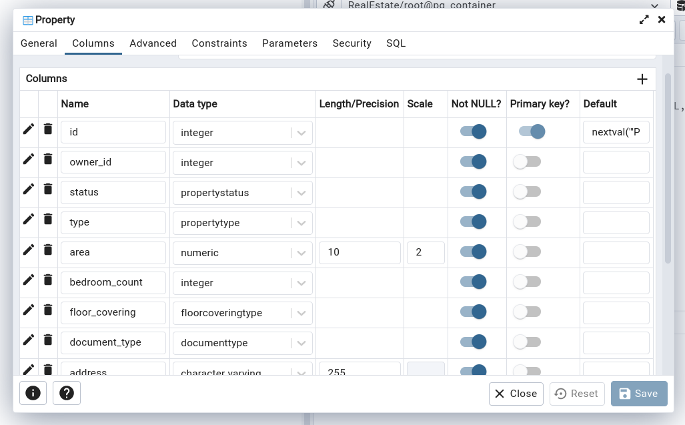

## د

در این بخش به کمک دستور `INSERT` داده های مورد نیاز را در جداول مالک و مسکن وارد میکنیم. برای این کار از بخش *RealEstate* گزینه `Query Tool` را انتخاب میکنیم.

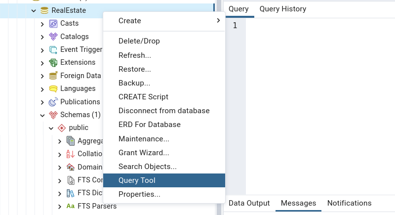

ابتدا دو مالک با دستور زیر ایجاد میکنیم.

```sql
INSERT INTO "Owner" (first_name, last_name, phone_number)
VALUES ('Ali', 'Rezaei', '09123456789');
INSERT INTO "Owner" (first_name, last_name, phone_number)
VALUES ('Mohammad', 'Ahmadi', '09876543210');
```

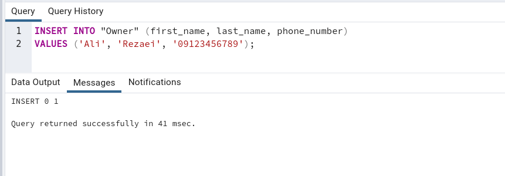

سپس یک مسکن با دستور زیر وارد میکنیم.

```sql
INSERT INTO "Property" (owner_id, status, type, area, bedroom_count, floor_covering, document_type, address, plate, price, rent, description, year_built)
VALUES (1, 'sale', 'apartment', 100, 2, 'ceramic', 'joint_ownership', 'Tehran, Valiasr St.', 1, 100000000, 0, 'A nice apartment', 1390);
```

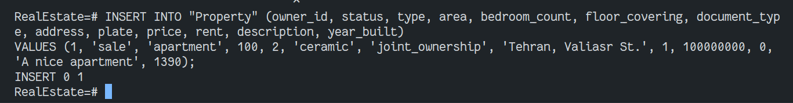

## ه

در این بخش چند داده غیر معتبر را در جدول مسکن وارد میکنیم و مشاهده میکنیم که چه اتفاقی میافتد. در این مثال شناسه مالک در جدول مالک وجود ندارد و این مسکن وارد نمیشود.

```sql
INSERT INTO "Property" (owner_id, status, type, area, bedroom_count, floor_covering, document_type, address, plate, price, rent, description, year_built)
VALUES (500, 'sale', 'apartment', 100, 2, 'ceramic', 'joint_ownership', 'Tehran, Valiasr St.', 1, 100000000, 0, 'A nice apartment', 1390);
```

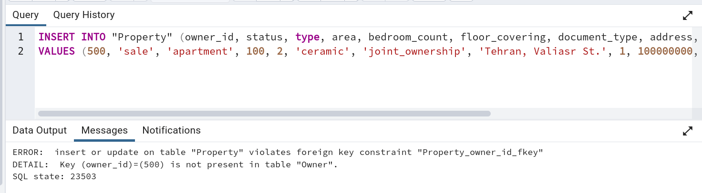

در مثال زیر مسکنی با مساحت منفی وارد میکنیم و مشاهده میکنیم که چه اتفاقی میافتد.

```sql
INSERT INTO "Property" (owner_id, status, type, area, bedroom_count, floor_covering, document_type, address, plate, price, rent, description, year_built)
VALUES (1, 'sale', 'apartment', -100, 2, 'ceramic', 'joint_ownership', 'Tehran, Valiasr St.', 1, 100000000, 0, 'A nice apartment', 1390);
```

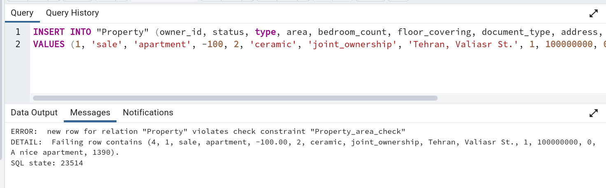

## ن

در این بخش به کمک دستور `SELECT` داده های موجود در جداول مالک و مسکن را مشاهده میکنیم.

```sql
SELECT * FROM "Owner";
```

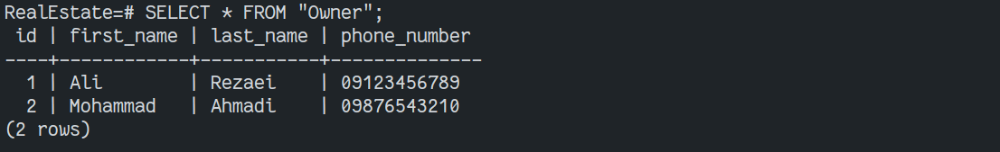

```sql
SELECT * FROM "Property";
```

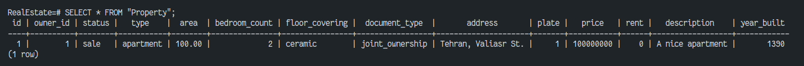
