# تمرین سری اول درس آز پایگاه

### گروه هفتم

---

## قسمت الف)

&nbsp;

### جدول "دکتر" :

- آیدی (PK)
- نام
- نام خانوادگی

### جدول "بیمار" :

- آیدی (PK)
- نام
- نام خانوادگی
- سن
- بیماری
- نام دکتر
- تاریخ مراجعه
- هزینه پرداختی

&nbsp;

---

## قسمت ب)

&nbsp;

##### برای ساخت دیتابیس از طریق محیط گرافیکی روی بخش `Databases` کلیک راست میکنیم. سپس گزینه `Create` و در پایان گزینه `Database` را میزنیم.

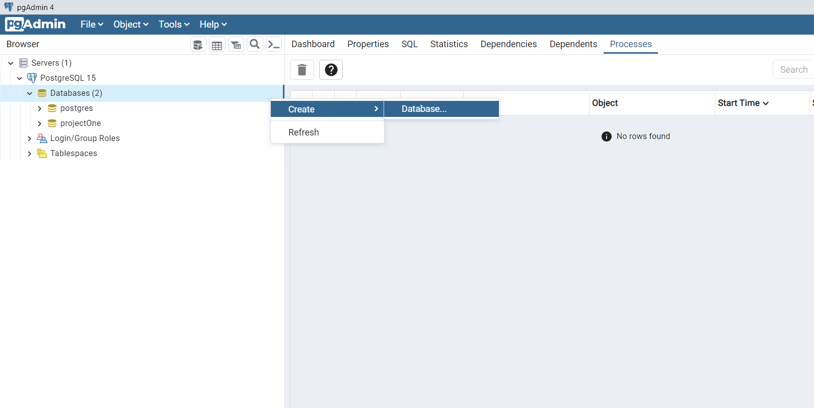

##### در صفحه باز شده میتوانیم نام دیتابیس (`Databse`)، سازنده آن (`Owner`) و یک توضیح مختصر (`Comment`) برای آن قرار دهیم.

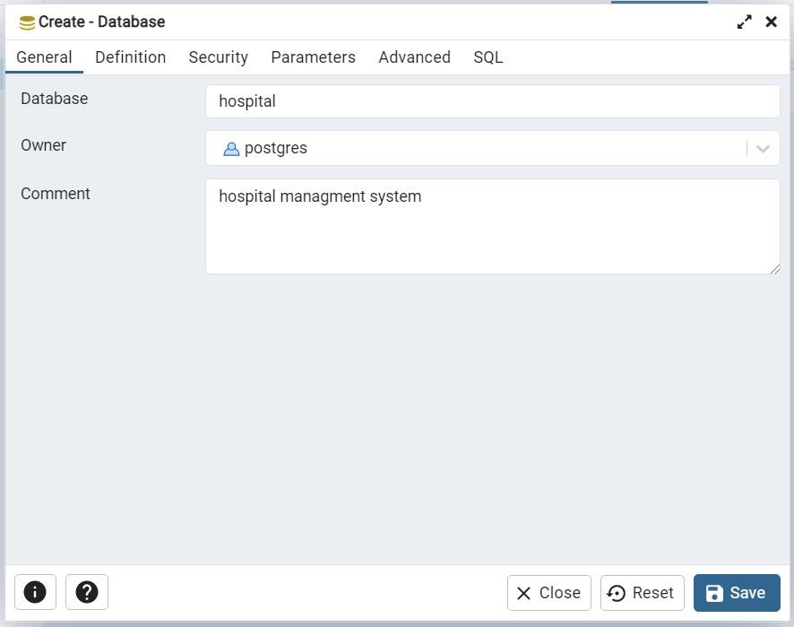

##### برای بررسی اینکه دیتابیس ساخته شده است هم میتوانیم از محیط گرافیکی استفاده کنیم اما برای این بخش ما از محیط Shell استفاده کرده ایم. با دستور `l\` لیست تمام دیتابیس های موجود را نمایش میدهد. همانطور که مشخص است دیتابیس hospital ساخته شده است.

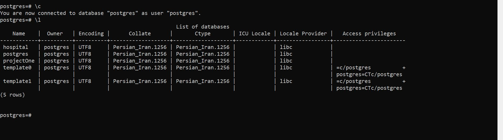

&nbsp;

---

## قسمت ج)

&nbsp;

##### برای نوشتن دستوراتی از قبیل ساخت جدول، درج اطلاعات، دریافت اطلاعات و ... از `Query Tool` استفاده میکنیم. در دیتابیس خود (`hospital`) به بخش `table` میرویم. کلیک راست میکنیم و گزینه `Query Tool` را میزنیم تا صفحه ای برای وارد کردن `query` به ما بدهد.

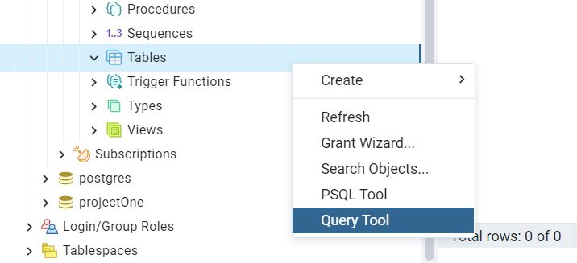

#### برای ساخت یک جدول جدید از دستور زیر استفاده میکنیم:

```
create table TABLE_NAME (TABLE_ATTRIBUTES);
```
&nbsp;

##### جدول دکتر دارای چهار `attribute` بود که به تمام آنها نوع داده `varchar` داده شده است و تنها در تعداد آنها تفاوت وجود دارد. `attribute` آیدی را کلید اصلی در نظر میگیریم و همینطور تمام آنها را غیر تهی (`not null`) در نظر میگیریم.

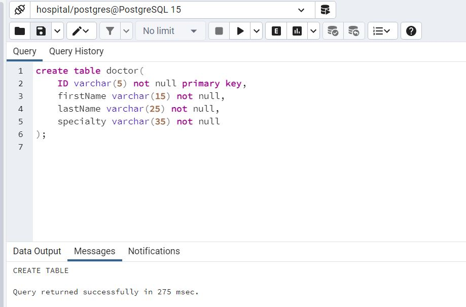

#### برای نمایش یک جدول از دستور زیر استفاده میکنیم:

```
select ATTRIBUTES_NAME from TABLE_NAME;
```
&nbsp;

##### با دستور `select * from doctor` شمای کلی جدول را که هوز خالی است مشاهده میکنیم.

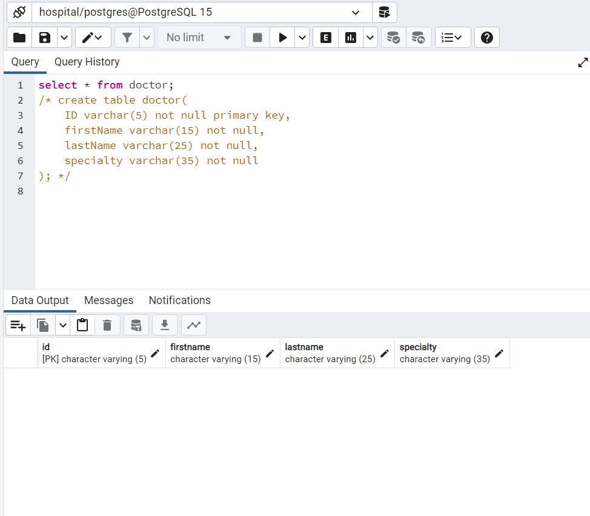

##### در جدول بیمار هم `attribute` آیدی را کلید اصلی در نظر میگیریم. همینطور `attribute` های نام، نام خانوادگی، بیماری و نام دکتر را `varchar`، سن و هزینه پرداختی را `integer` و تاریخ ورود را از نوع `date` ایجاد میکنیم. علاوه بر اینها شرط اینکه سن فرد باید بیش از صفر و هزینه پرداختی حتما باید بیش از 100 باشد را هم داریم.

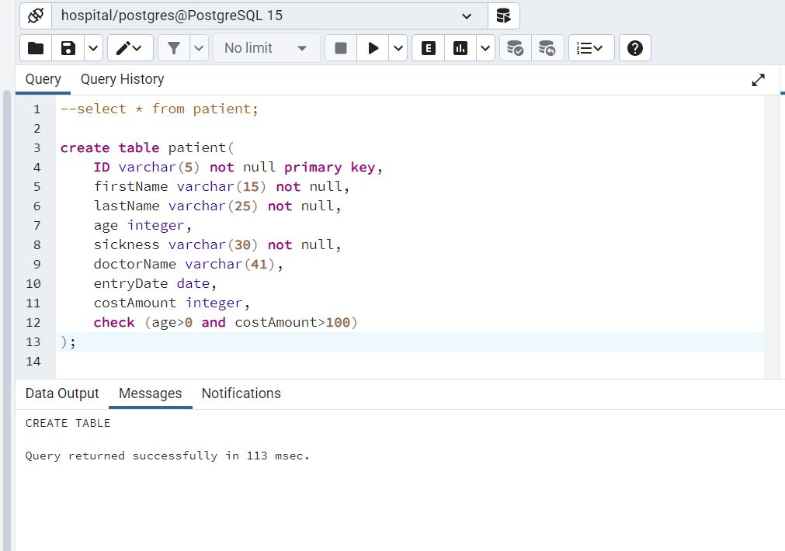

##### برای دیدن شمای کلی این جدول هم از دستور `select * from patient` استفاده میکنیم.

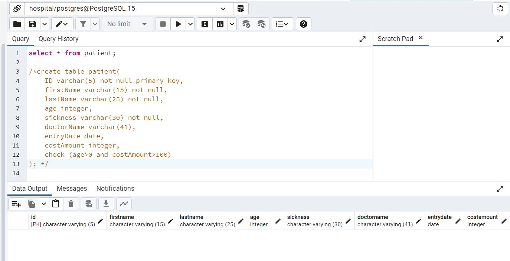

&nbsp;

---

## قسمت د)

&nbsp;

#### یکی از راه های درج اطلاعات در جداول بصورت الگوی زیر است.
```
insert into TABLE_NAME  values (ATTRIBUTES_VALUE);
```
&nbsp;
##### در این قسمت یک ردیف قبلا `insert` کرده ایم و حال دو ردیف `row` دیگر اضافه میکنیم و سپس دستور `select` را همزمان اجرا میکنیم. همانطور که مشخص است داده ها ثبت شده اند.


#### نوع دیگری از ثبت اطلاعات با الگوی زیر انجام میشود:
```
insert into TABLE_NAME (ATTRIBUTES_ORDER) values (ATTRIBUTES_VALUE);
```

##### در این نمونه هم با الگوی دلخواه یک ردیف به جدول اضافه میکنیم و همزمان با دستور `select` آنها را نمایش میدهیم.
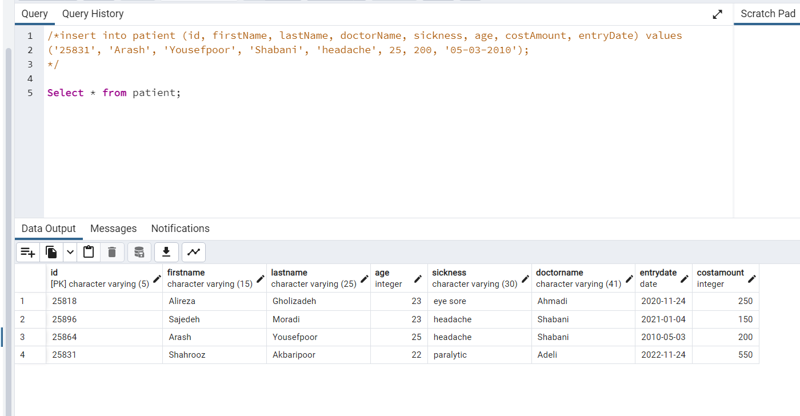

&nbsp;

---

## قسمت ه)

&nbsp;
##### در این حالت اقدام به ثبت مورد جدیدی کردیم با یک آیدی تکراری که قبلا وجود داشت. در این حالت اروری مبنی بر اینکه یک آیدی با همین مقدار مجود دارد نمایش داده میشود. کلید اصلی خود دارای شرط `unique` بودن هم هست.
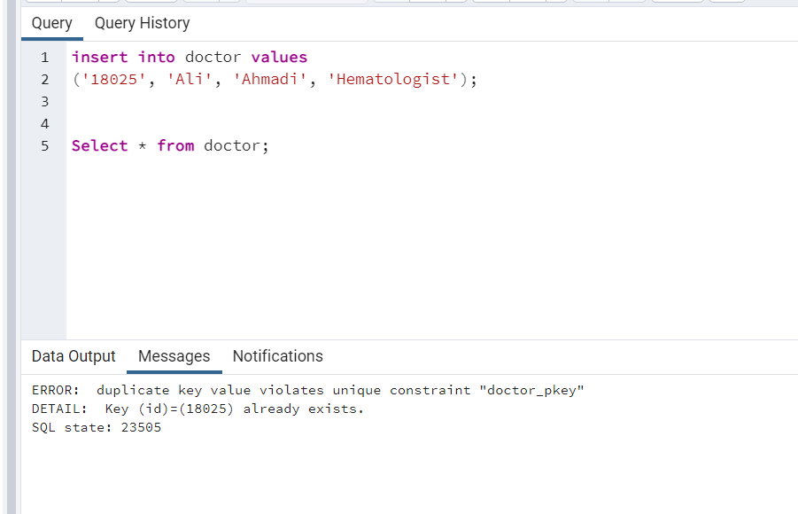
##### دقیقا شبیه به مثال قبل و اینبار برای جدول بیمار
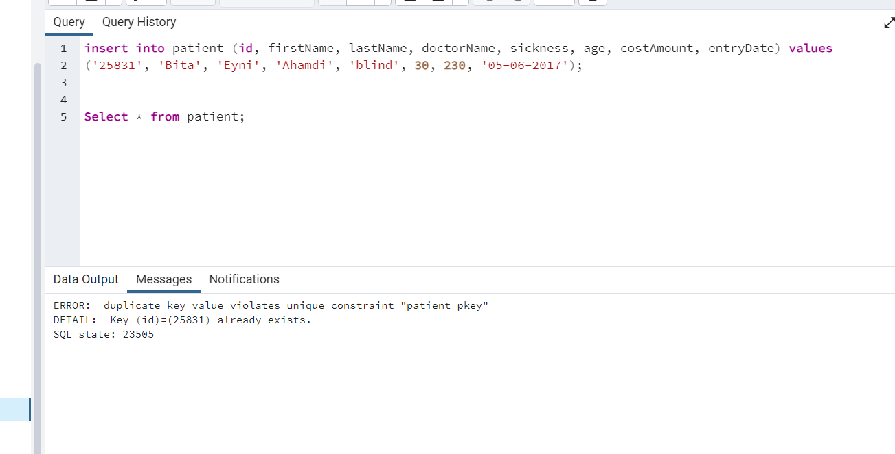
##### در این حالت شرط بزرگتر از صفر بودن سن را رعایت نکرده ایم و اروری مبنی بر رعایت نشدن شرط `check` را مشاهده میکنیم.
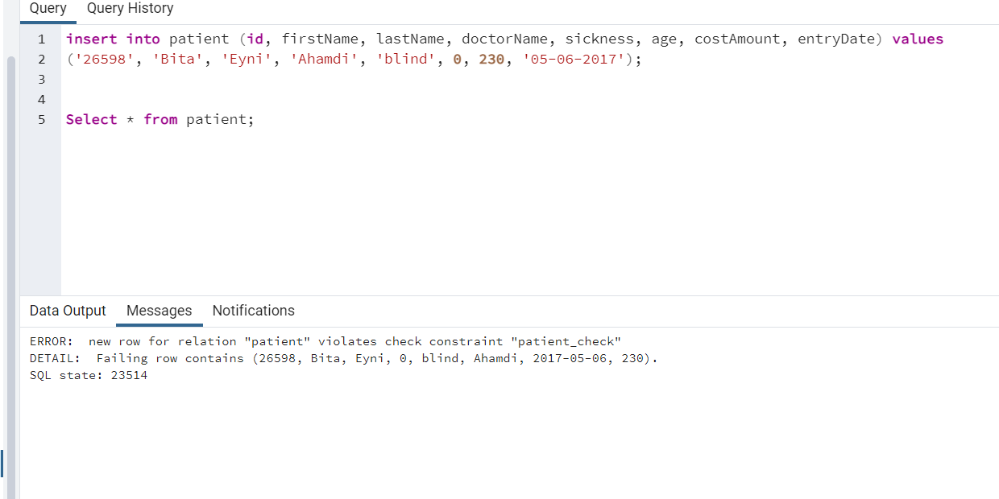
##### در این حالت هم شرط بزرگتر از 100 بودن هزینه پرداختی را رعایت نکردیم که دقیقا ارور مثال قبل را دریافت کردیم زیرا شرط بررسی هر دو `attribute`  را در `check` قرار داده بودیم.
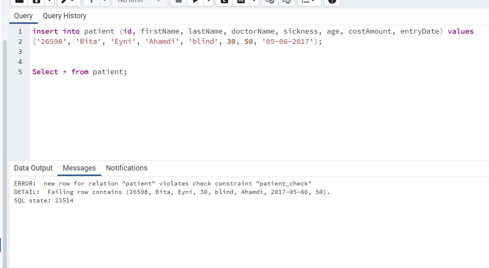

&nbsp;

---

## قسمت ه)

&nbsp;

#### الگوی استفاده از کلمه کلیدی `like` بصورت زیر است:
```
where ATTRIBUTE_NAME like PATTERN
```

##### در این قسمت میخواهیم جداول را با بررسی های خاص و یا با شروط مشخص دریافت کنیم. در این نمونه در جدول دکتر، تمام دکتر هایی که در نام خانوادگی آنها حرف `o` وجود دارد را بر میگرداند.
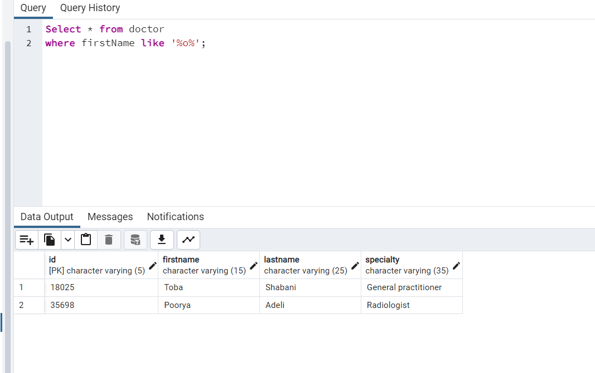
##### علامت `%` به این معناست که هرتعداد نا محدودی میتواند موجود باشد.
##### علامت `_` به معنای تعداد محدود و به اندازه ی همین علامت مکان برای کاراکتر هاست.
#### الگوی استفاده از `where` بصورت زیر است:
```
select ATTRIBUTE_NAME from TABLE_NAME where CONDITION
```
##### در مثال زیر بیمارانی را که بعد از تاریخ مذکور ثبت شده اند را مشخص میکند.
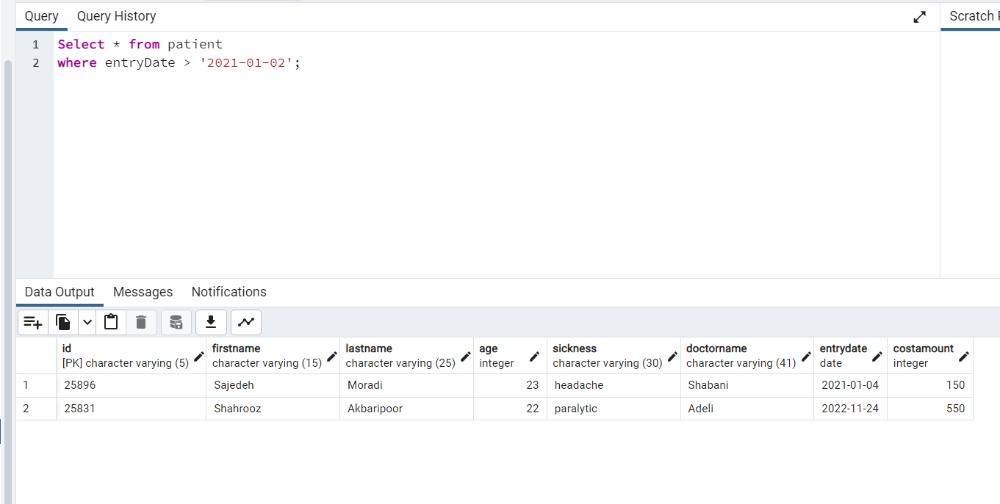
##### در این نمونه هم شرط خاصی را روی هزینه پرداختی بیماران قرار دادیم و پاسخ نمایش داده میشود.
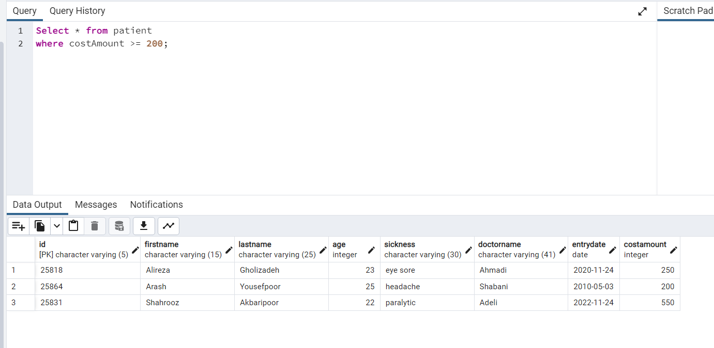