<div dir="auto">
    

# تمرین دوم آزمایشگاه پایگاه داده

گروه شماره ۶

---

## نحوه وارد کردن داده‌های datacamp.com

پس از دریافت فایل `cinema.zip` از کانال تلگرام، آن را `unzip` می‌کنیم و با دستور زیر فایل دستورات را اجرا می‌کنیم تا جداول مربوطه ایجاد شوند.
```sql
\i pathToSqlFile;
```
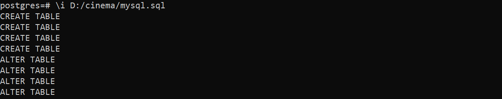

سپس برای اضافه کردن داده‌ها از فایل `txt` به جداول، از دستورات زیر استفاده می‌کنیم.
```sql
COPY films FROM pathToFilmsTxtFile (ENCODING 'UTF8');
COPY people FROM pathToPeopleTxtFile (ENCODING 'UTF8');
COPY reviews FROM pathToReviewsTxtFile (ENCODING 'UTF8');
COPY roles FROM pathToRolesTxtFile (ENCODING 'UTF8');
```
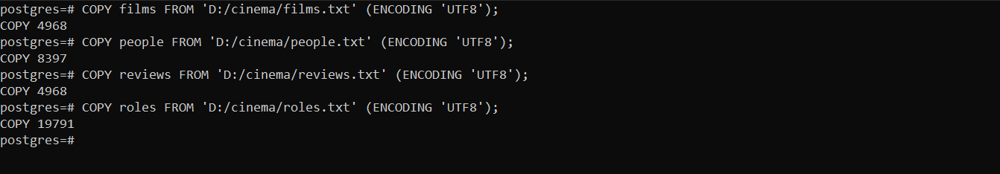

## پرسش‌ها

1 - ستون عنوان را از جدول فیلم‌ها انتخاب کنید . 
```sql
SELECT title FROM films;
```
<details>
    <summary>Output</summary>
    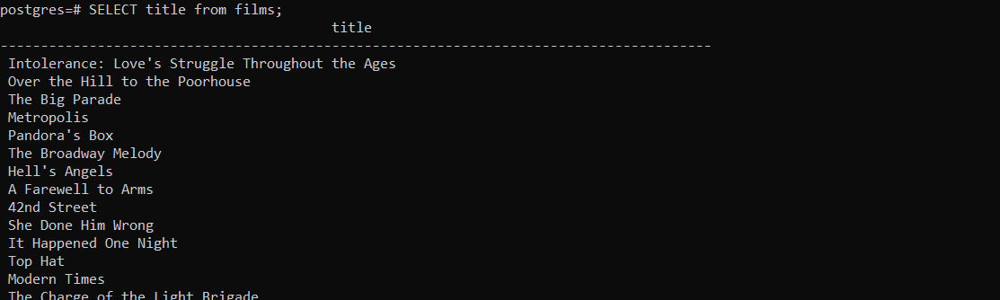    
</details>

2 - نتیجه پرس‌وجو زیر چه چیزی است؟
 
```sql
SELECT (10 / 3);
```
نتیجه، حاصل تقسیم ۱۰ بر ۳ می‌باشد.
<details>
    <summary>Output</summary>
    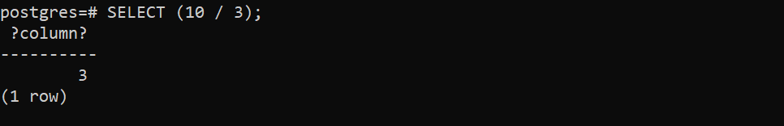
</details>

3 - ستون سال انتشار (سال اکران) را از جدول فیلم‌ها انتخاب کنید.
 
```sql
SELECT release_year FROM films;
```
<details>
    <summary>Output</summary>
    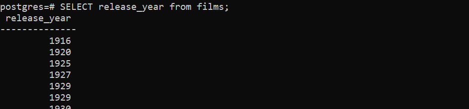
</details>

4 - نام هر فرد را در جدول افراد انتخاب کنید.
 
```sql
SELECT name FROM people;
```
<details>
    <summary>Output</summary>
    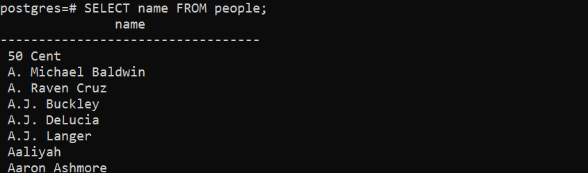
</details>

5 - عنوان هر فیلم را از جدول فیلم‌ها دریافت کنید.
 
همان  پرسش `شماره 1` می‌باشد!!!
```sql
SELECT title FROM films;
```
<details>
    <summary>Output</summary>
    
</details>

6 - عنوان و سال اکران هر فیلم را دریافت کنید.
 
```sql
SELECT title, release_year FROM films;
```
<details>
    <summary>Output</summary>
    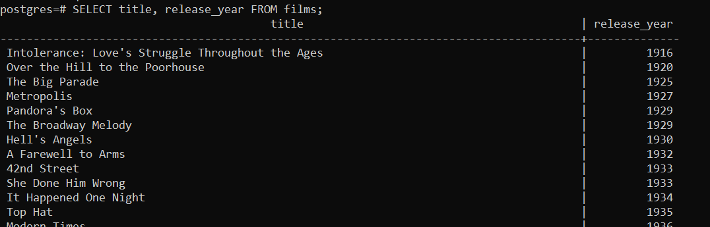
</details>

7 - عنوان، سال اکران و کشور را برای هر فیلم دریافت کنید
 
```sql
SELECT title, release_year, country FROM films;
```
<details>
    <summary>Output</summary>
    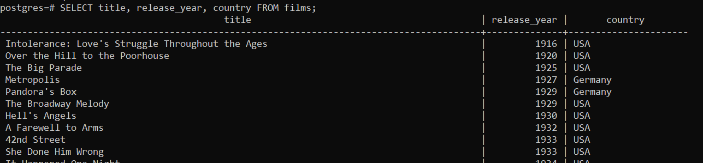
</details>

8 - همه ستون‌ها را از جدول فیلم‌ها دریافت کنید.
 
```sql
SELECT * FROM films;
```
<details>
    <summary>Output</summary>
    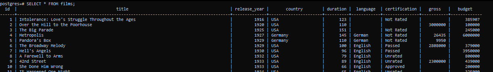
</details>

9 - همه کشورهای منحصربه‌فرد نشان داده شده در جدول فیلم‌ها را دریافت کنید.
 
```sql
SELECT DISTINCT country FROM films;
```
<details>
    <summary>Output</summary>
    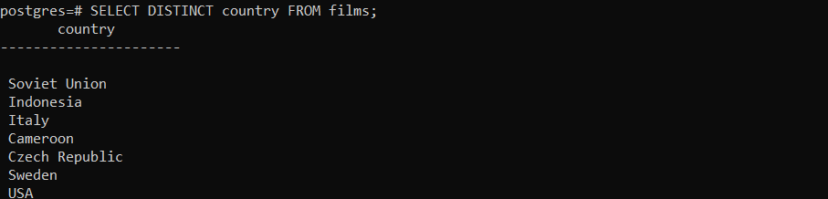
</details>

10 - همه گواهینامه‌های مختلف فیلم را از جدول فیلم‌ها دریافت کنید.
 
```sql
SELECT certification FROM films;
```
<details>
    <summary>Output</summary>
    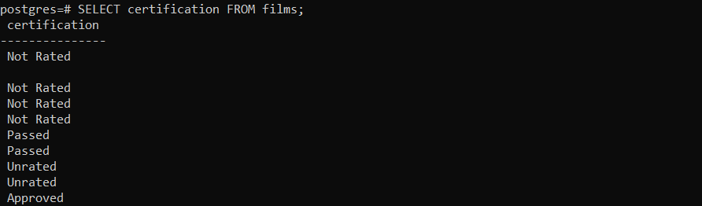
</details>

11 - انواع مختلف نقش‌های فیلم را از جدول نقش‌ها دریافت کنید.
 
```sql
SELECT role FROM roles;
```
<details>
    <summary>Output</summary>
    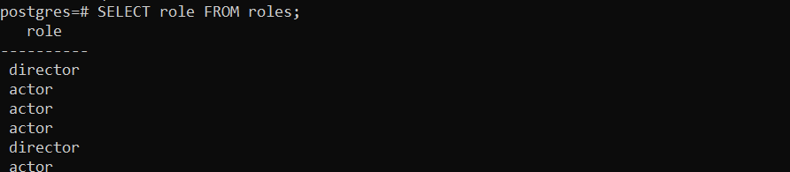
</details>

12 - تعداد ردیف‌های (رکوردهای) موجود در جدول افراد را بشمارید
 
```sql
SELECT COUNT(*) FROM people;
```
<details>
    <summary>Output</summary>
    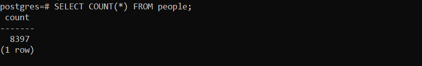
</details>

13 - تعداد تاریخ‌های تولد (آنهایی که وارد جدول شده‌اند و وجود دارند) را در جدول افراد بشمارید.
 
```sql
SELECT COUNT(birthdate) FROM people;
```
تابع `COUNT` فقط موارد غیر `NULL` را می‌شمارد.
<details>
    <summary>Output</summary>
    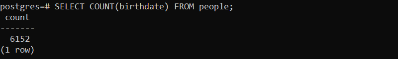
</details>

14 - تعداد تاریخ تولدهای منحصربه‌فرد را در جدول افراد بشمارید.
 
```sql
SELECT COUNT(DISTINCT birthdate) FROM people;
```
<details>
    <summary>Output</summary>
    
</details>

15 - تعداد کشورهای منحصربه‌فرد را در جدول فیلم‌ها بشمارید.
 
```sql
SELECT COUNT(DISTINCT country) FROM films;
```
<details>
    <summary>Output</summary>
    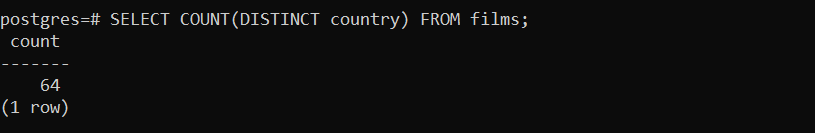
</details>

16 - تمام جزئیات را برای همه فیلم‌های منتشر شده در سال `2016` بدهید.
 
```sql
SELECT * FROM films WHERE release_year=2016;
```
<details>
    <summary>Output</summary>
    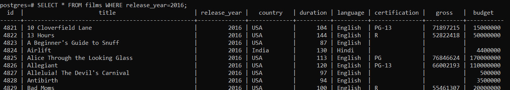
</details>

17 - شمار فیلم‌های اکران شده قبل از سال `2000` را استخراج کنید.

```sql
SELECT COUNT(*) FROM films WHERE release_year<2000;
```
<details>
    <summary>Output</summary>
    
</details>

18 - عنوان و سال اکران فیلم‌هایی که پس از سال `2000` منتشر شده‌اند را دریافت کنید.

```sql
SELECT title, release_year FROM films WHERE release_year>2000;
```
<details>
    <summary>Output</summary>
    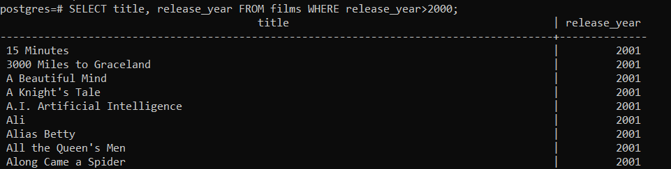
</details>

19 - تمام جزئیات فیلم‌های فرانسوی زبان را دریافت کنید .

```sql
SELECT * FROM films WHERE language='French';
```
<details>
    <summary>Output</summary>
    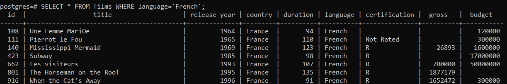
</details>

20 - نام و تاریخ تولد فردی که در تاریخ `11 نوامبر 1974 ` متولد شده است را دریافت کنید.

```sql
SELECT name, birthdate FROM people WHERE birthdate='1974-11-11';
```
<details>
    <summary>Output</summary>
    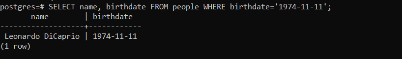
</details>

21 - شمار فیلم‌های هندی زبان را دریافت کنید.

```sql
SELECT COUNT(*) FROM films WHERE country = 'India';
```
<details>
    <summary>Output</summary>
    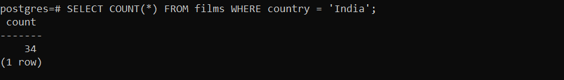
</details>

22 - تمام جزئیات را برای همه فیلم‌ها با گواهینامه `R` دریافت کنید.

```sql
SELECT * FROM films WHERE certification = 'R';
```
<details>
    <summary>Output</summary>
    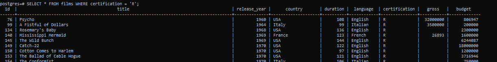
</details>

23 - عنوان و سال اکران را برای همه فیلم‌های اسپانیایی زبان که قبل از سال `2000` منتشر شده‌اند، دریافت کنید.

```sql
SELECT title, release_year FROM films WHERE language = 'Spanish' AND release_year < 2000;
```
<details>
    <summary>Output</summary>
    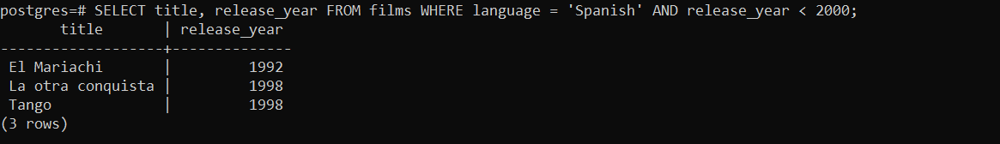
</details>

24 - عنوان و سال اکران را برای فیلم‌های منتشر شده در دهه `90` دریافت کنید.

```sql
SELECT title, release_year FROM films WHERE release_year BETWEEN 1990 AND 1999;
```
<details>
    <summary>Output</summary>
    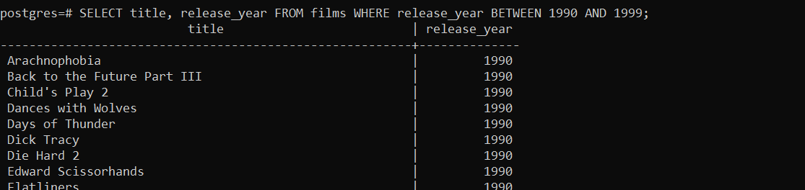
</details>

25 - عنوان و سال انتشار تمامی فیلم‌هایی را بدهید که در فاصله سال‌های 
`1990` و `2000` منتشر شده‌اند.

```sql
SELECT title, release_year FROM films WHERE release_year BETWEEN 1990 AND 2000;
```
<details>
    <summary>Output</summary>
    
</details>

26 - عنوان و سال اکران همه فیلم‌هایی که در سال `1990` یا `2000` ،بیشتر از دو ساعت بودند را دریافت کنید.

```sql
SELECT title, release_year FROM films WHERE release_year IN (1990, 2000) AND duration > 120;
```
<details>
    <summary>Output</summary>
    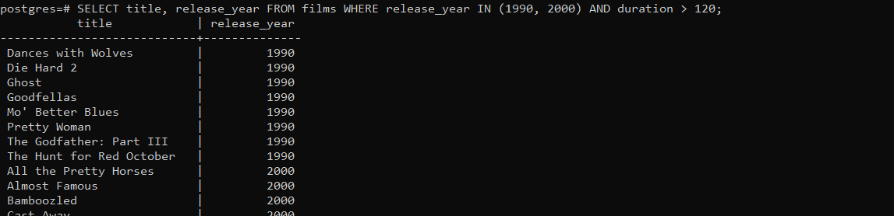
</details>

27 - نام افرادی را که هنوز زنده هستند دریافت کنید.

```sql
SELECT name FROM people WHERE deathdate IS NULL;
```
<details>
    <summary>Output</summary>
    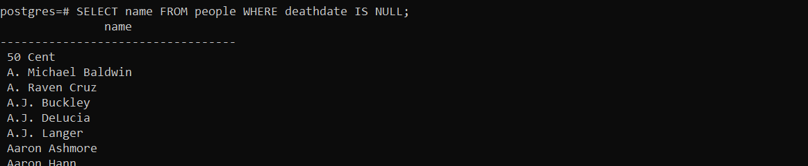
</details>

28 - شمار فیلم‌هایی را که رکورد مربوط به آنها، فیلد زبان ندارد، دریافت کنید.

```sql
SELECT COUNT(*) FROM films WHERE language IS NULL;
```
<details>
    <summary>Output</summary>
    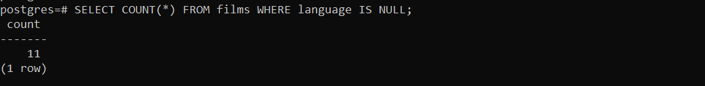
</details>

29 - نام همه افرادی را که نام آنها با `B `شروع می شود ، دریافت کنید. 

```sql
SELECT name FROM people WHERE name LIKE 'B%';
```
<details>
    <summary>Output</summary>
    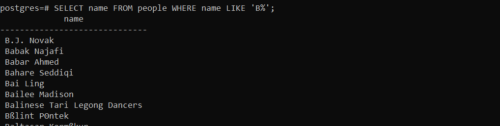
</details>

30 - اسامی افرادی را که حرف دوم آنها `r` است ، دریافت نمایید.

```sql
SELECT name FROM people WHERE SUBSTR(name, 2, 1) = 'r';
```
<details>
    <summary>Output</summary>
    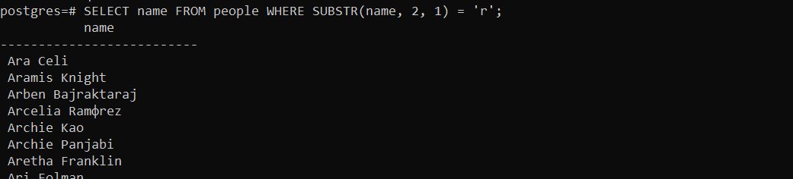
</details>

31 - از تابع `SUM` برای دریافت کل مدت زمان همه فیلم‌ها استفاده کنید.

```sql
SELECT SUM(duration) FROM films;
```
<details>
    <summary>Output</summary>
    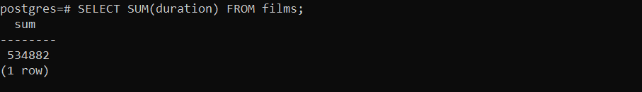
</details>

32 - مدت زمان طولانی ترین فیلم را دریافت کنید.

```sql
SELECT MAX(duration) FROM films;
```
<details>
    <summary>Output</summary>
    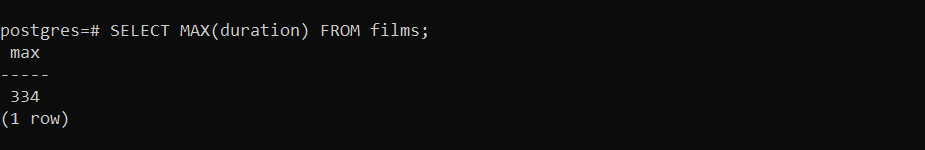
</details>

33 - میانگین مدت تمام فیلم‌ها را دریافت کنید.

```sql
SELECT AVG(duration) FROM films;
```
<details>
    <summary>Output</summary>
    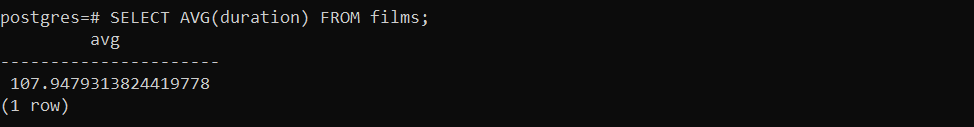
</details>

34 - میانگین درآمد همه فیلم‌ها را دریافت کنید.

```sql
SELECT AVG(gross) FROM films;
```
<details>
    <summary>Output</summary>
    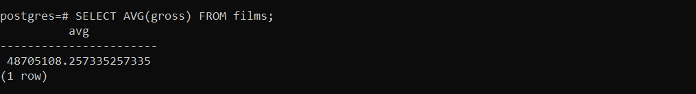
</details>

35 - از تابع `SUM` برای بدست آوردن کل درآمد حاصل از تمام فیلم‌های ساخته شده در سال `2000` 
یا بعد استفاده کنید.

```sql
SELECT SUM(gross) FROM films WHERE release_year >= 2000;
```
<details>
    <summary>Output</summary>
    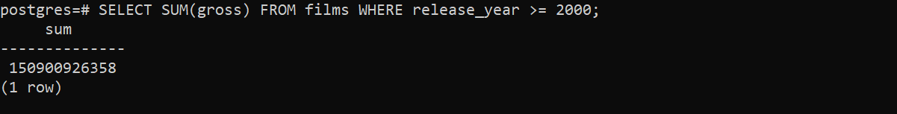
</details>

36 - میانگین درآمد همه فیلم‌هایی که عنوان آنها با حرف `A` شروع می‌شود را دریافت کنید .

```sql
SELECT AVG(gross) FROM films WHERE title LIKE 'A%';
```
<details>
    <summary>Output</summary>
    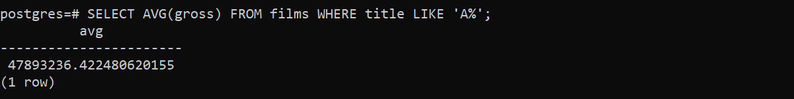
</details>

37 - درآمد بدترین فیلم در سال `1994` را دریافت کنید.

```sql
SELECT MIN(gross) FROM films WHERE release_year = 1994;
```
<details>
    <summary>Output</summary>
    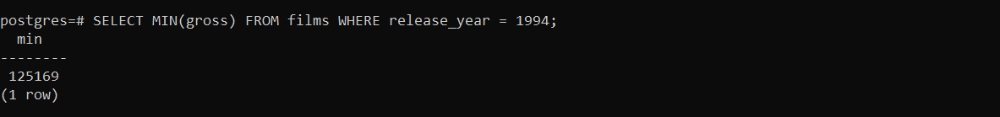
</details>

38 - مبلغی را که بهترین فیلم در بین سال های `2000` تا `2012` به دست آورده است را دریافت کنید.

```sql
SELECT MAX(gross) FROM films WHERE release_year BETWEEN 2000 AND 2012;
```
<details>
    <summary>Output</summary>
    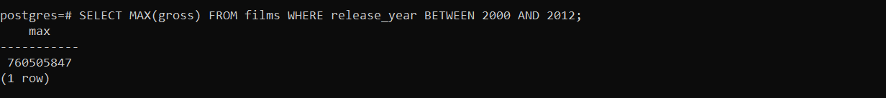
</details>

39 - درصد افرادی که دیگر در قید حیات نیستند را دریافت کنید. باید حاصل را به عنوان 
`percentage_dead` نام مستعار (`alias`) نمایید.

```sql
SELECT 100.0 * SUM(CASE WHEN deathdate IS NOT NULL THEN 1 ELSE 0 END) / COUNT(*) AS percentage_dead FROM people;
```
<details>
    <summary>Output</summary>
    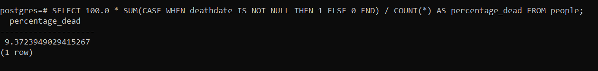
</details>

40 - تعداد دهه هایی که جدول فیلم‌ها آن را پوشش می‌دهد دریافت کنید. باید حاصل را به عنوان 
`number_of_decades` نام مستعار (`alias`) نمایید.

```sql
SELECT COUNT(DISTINCT FLOOR(release_year / 10)) AS number_of_decades FROM films;
```
<details>
    <summary>Output</summary>
    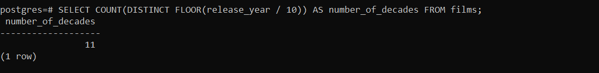
</details>

41 - تمام جزئیات را برای همه فیلم‌ها با گواهینامه غیر از `R` دریافت کنید.

```sql
SELECT * FROM films WHERE certification != 'R';
```
<details>
    <summary>Output</summary>
    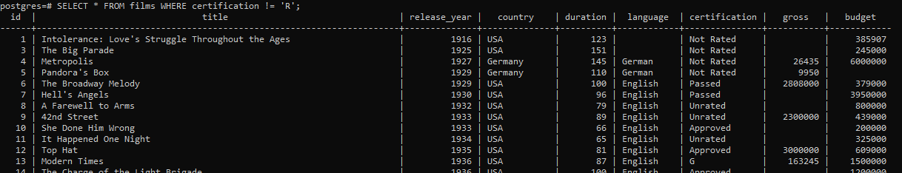
</details>

42 - عنوان و سود خالص (مبلغی که یک فیلم به دست آورده، منهای بودجه آن) را برای همه فیلم 
ها دریافت کنید. سود خالص را به عنوان `net_profit` نام مستعار (`alias`) کنید. 

```sql
SELECT title, gross - budget AS net_profit FROM films;
```
<details>
    <summary>Output</summary>
    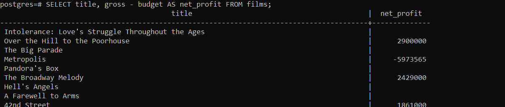
</details>

 دلیل `NULL` بودن بعضی از عناوین، مربوط به  `NULL` بودن مقدار `gross` یا `budget` برای آنان می‌باشد که با دستور زیر می‌توان از این موارد چشم‌پوشی کرد. 

```sql
SELECT title, gross - budget AS net_profit FROM films WHERE gross IS NOT NULL AND budget IS NOT NULL;
```

43 - عنوان و مدت زمان همه فیلم‌ها را بر حسب ساعت بدهید . مدت زمان بر حسب دقیقه است، 
بنابراین برای بدست آوردن مدت زمان بر حسب ساعت، باید بر `60.0` تقسیم کنید. مدت زمان را به عنوان 
`duration_hours` نام مستعار (`alias`) کنید. 

```sql
SELECT title, duration / 60.0 AS duration_hours FROM films;
```
<details>
    <summary>Output</summary>
    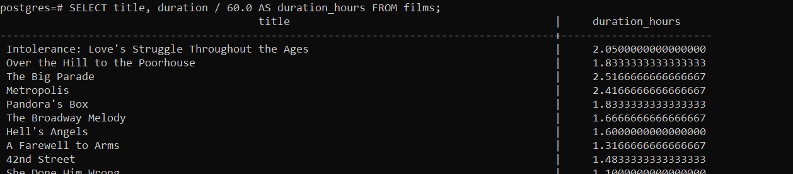
</details>

44 - میانگین مدت زمان را بر حسب ساعت برای همه فیلم‌ها، با نام مستعار 
`avg_duration_hours` دریافت کنید. 

```sql
SELECT AVG(duration/60.0) AS avg_duration_hours FROM films;
```
<details>
    <summary>Output</summary>
    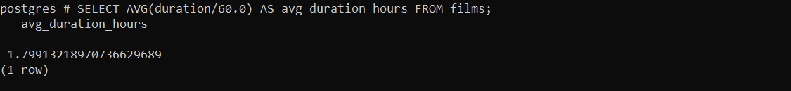
</details>


45 - نام افراد را از جدول افراد، به ترتیب حروف الفبا، دریافت کنید.

```sql
SELECT name FROM people ORDER BY name ASC;
```
<details>
    <summary>Output</summary>
    
</details>

46 - اسامی افراد را بر اساس ترتیب تاریخ تولد دریافت کنید.

```sql
SELECT name FROM people ORDER BY birthdate ASC;
```
<details>
    <summary>Output</summary>
    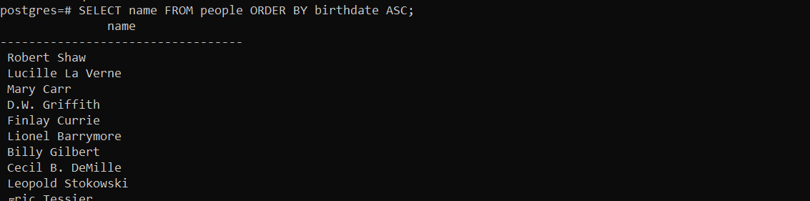
</details>

47 - تاریخ تولد و نام هر فرد را بر اساس ترتیب زمانی که متولد شده‌اند، دریافت کنید.

```sql
SELECT birthdate, name FROM people ORDER BY birthdate ASC;
```
<details>
    <summary>Output</summary>
    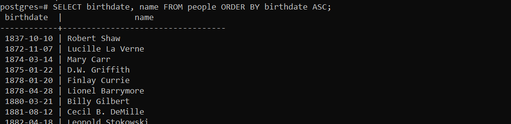
</details>

48 - عنوان فیلم‌های اکران شده در سال `2000` یا `2012` را به ترتیبی که اکران شده‌اند، دریافت 
کنید.

```sql
SELECT title FROM films WHERE release_year IN (2000, 2012) ORDER BY release_year ASC;
```
<details>
    <summary>Output</summary>
    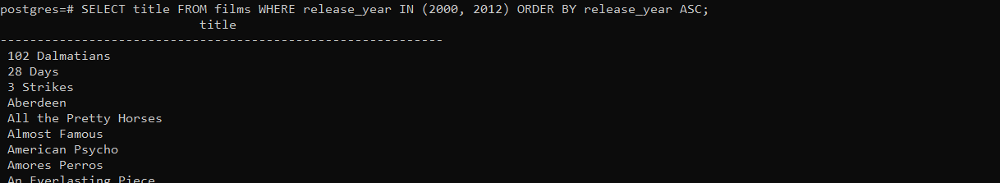
</details>

49 - تمام جزئیات را برای همه فیلم ها به جز فیلم هایی که در سال `2015` منتشر شده‌اند، به گونه‌ای 
دریافت کنید که بر اساس مدت زمان مرتب شده باشند.

```sql
SELECT * FROM films WHERE release_year != 2015 ORDER BY duration ASC;
```
<details>
    <summary>Output</summary>
    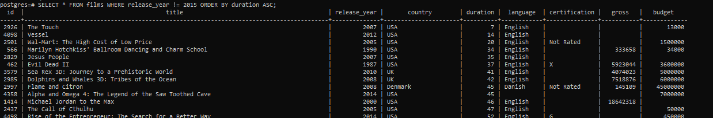
</details>

50 - عنوان و درآمد ناخالص فیلم‌هایی را که با حرف  `M` شروع می شوند، دریافت کنید و نتایج 
را بر اساس حروف الفبا مرتب نمایید.

```sql
SELECT title, gross FROM films WHERE title LIKE 'M%' ORDER BY title ASC;
```
<details>
    <summary>Output</summary>
    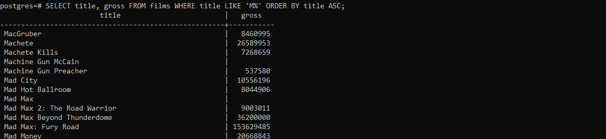
</details>

51 - امتیاز `IMDB` و شناسه فیلم را برای هر فیلم از جدول نقدها، مرتب سازی شده از بالاترین به 
پایین‌ترین امتیاز بدهید.

```sql
SELECT imdb_score, film_id FROM reviews ORDER BY imdb_score DESC;
```
<details>
    <summary>Output</summary>
    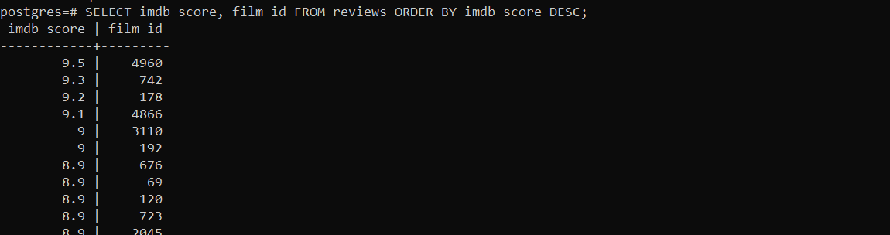
</details>

52 - عنوان و مدت زمان هر فیلم را به ترتیب از طولانی‌ترین مدت به کوتاه‌ترین دریافت کنید.

```sql
SELECT title, duration FROM films ORDER BY duration DESC;
```
<details>
    <summary>Output</summary>
    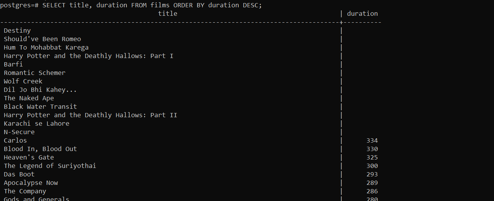
</details>

53 - تاریخ تولد و نام افراد در جدول افراد را به ترتیب زمان تولد و بر اساس ترتیب الفبایی نام ها 
دریافت کنید.

```sql
SELECT birthdate, name FROM people ORDER BY birthdate, name ASC;
```
<details>
    <summary>Output</summary>
    
</details>

54 - گواهینامه‌ها، سال‌های اکران و عناوین فیلم‌ها را به ترتیب بر اساس 
گواهینامه (الفبایی) و سال اکران دریافت کنید.

```sql
SELECT certification, release_year, title FROM films ORDER BY certification, release_year ASC;
```
<details>
    <summary>Output</summary>
    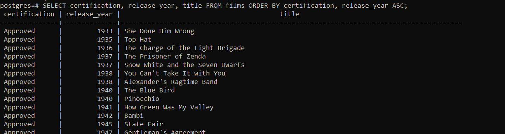
</details>

55 - سال اکران و تعداد فیلم‌های منتشر شده در هر سال را دریافت نمایید.

```sql
SELECT release_year, COUNT(*) FROM films GROUP BY release_year;
```
<details>
    <summary>Output</summary>
    
</details>

56 - سال اکران و میانگین مدت زمان همه فیلم‌ها را بر اساس سال اکران گروه‌بندی کنید.

```sql
SELECT release_year, AVG(duration) FROM films GROUP BY release_year;
```
<details>
    <summary>Output</summary>
    
</details>

57 - دریافت سال اکران و بیشترین بودجه برای همه فیلم‌ها، گروه‌بندی شده بر اساس سال اکران.

```sql
SELECT release_year, MAX(budget) FROM films GROUP BY release_year;
```
<details>
    <summary>Output</summary>
    
</details>

58 - زبان و کل درآمد ناخالص فیلم‌ها را در هر زبانی که ساخته شده‌اند، دریافت کنید.

```sql
SELECT language, SUM(gross) FROM films GROUP BY language;
```
<details>
    <summary>Output</summary>
    
</details>

59 - سال اکران، کشور و بیشترین بودجه‌ای که برای ساخت یک فیلم برای هر سال، برای هر 
کشور صرف شده است را دریافت کنید. نتایج خود را بر اساس سال اکران و کشور مرتب نمایید.

```sql
SELECT release_year, country, MAX(budget) FROM films GROUP BY release_year, country ORDER BY release_year, country;
```
<details>
    <summary>Output</summary>
    
</details>

60 - در چند سال مختلف بیش از `200` فیلم اکران شد؟

```sql
SELECT COUNT(*) FROM (
    SELECT release_year FROM films GROUP BY release_year HAVING COUNT(*) > 200
    ) CNT;
```
<details>
    <summary>Output</summary>
    
</details>

61 - کشور، متوسط بودجه و میانگین درآمد ناخالص کشورهایی که بیش از `10` فیلم ساخته‌اند را 
دریافت کنید. نتیجه را بر اساس نام کشور مرتب و تعداد نتایج نمایش داده شده را به `5` محدود کنید . باید 
میانگین‌ها را به ترتیب به عنوان `avg_budget` و `avg_gross` نام مستعار (`alias`) کنید .

```sql
SELECT country, AVG(budget) AS avg_budget, AVG(gross) AS avg_gross FROM films GROUP BY country HAVING COUNT(*) > 10 ORDER BY country LIMIT 5;
```
<details>
    <summary>Output</summary>
    
</details>


</div>