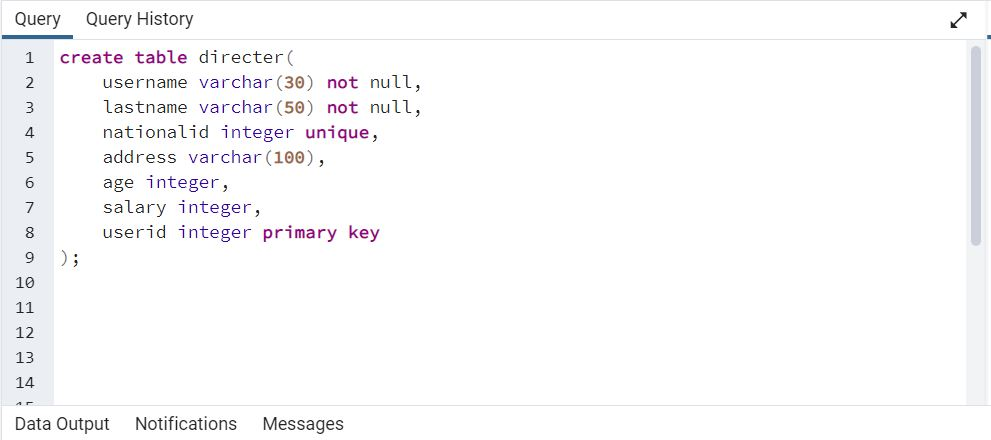
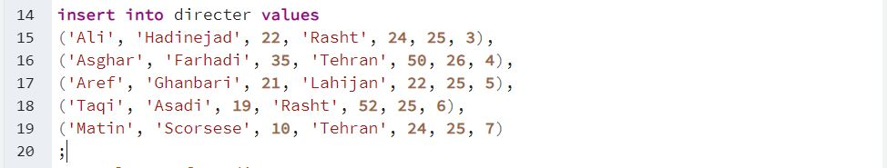
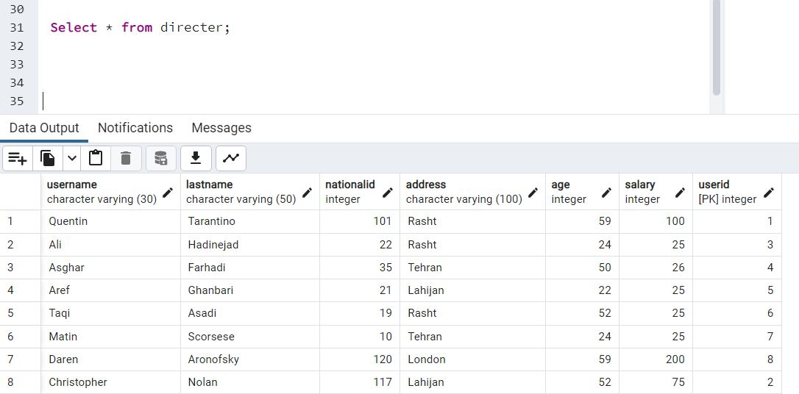
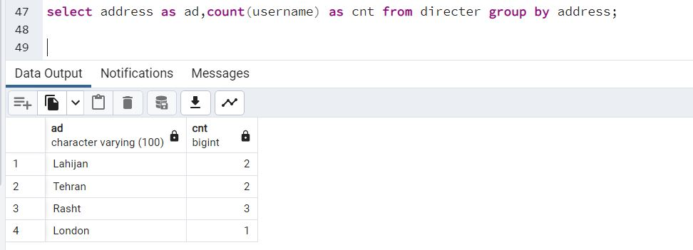
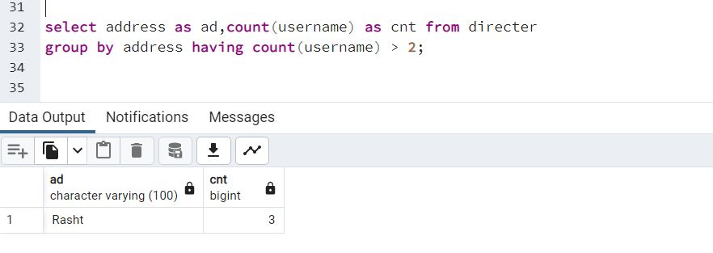

# کدهای کلاس آز پایگاه داده  
### گروه هفتم
***
&nbsp;
#### ابتدا جداول را می سازیم.
&nbsp;

***
#### سپس مقادیر را وارد می کنیم.

&nbsp;

***
#### اطلاعات کارگردان ها را نمایش می دهیم.
&nbsp;

***
#### اطلاعات کارگردان ها را نمایش می دهیم.
#### آدرس و تعداد یوزرنیم ها را توسط نام های مستعار مشخص شده برمی گردانیم.
&nbsp;

#### همینطور آدرس ها را گروه بندی میکنیم.(یعنی تعداد دفعات تکرار هر کدام از آدرس ها را نمایش می دهیم)
&nbsp;

***
#### دقیقا مشابه حالت قبلی می باشد تنها در این مورد قید شرط بیشتر بودن یوزرنیم از 2 را داریم.
&nbsp;

