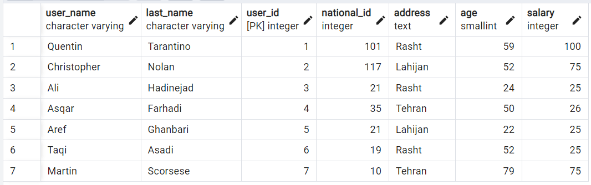

# Company
## create table
`create table company (
	user_name varchar, 
	last_name varchar,
	national_id int,
	address text,
	age smallint,
	salary int,
	user_id serial,
	primary key (user_id)
);`

## insert samples
`insert into company (user_name,last_name,national_id,address,age,salary) values`\
`('Quentin', 'Tarantino', 101, 'Rasht', 59, 100),`\
`('Christopher', 'Nolan', 117, 'Lahijan', 52, 75),`\
`('Ali', 'Hadinejad', 21, 'Rasht', 24, 25),`\
`('Asqar', 'Farhadi', 35, 'Tehran', 50, 26),`\
`('Aref', 'Ghanbari', 21, 'Lahijan', 22, 25),`\
`('Taqi', 'Asadi', 19, 'Rasht', 52, 25),`\
`('Martin', 'Scorsese', 10, 'Tehran', 79, 75);`\
\

## number of users in each address
`select address as ad, count(user_name) as cnt from company group by address;`\
\

## number of users in each address which are more than 2
`select address as ad, count(user_name) as cnt from company group by address having count(user_name) > 2;`\
\

## number of users in each address which have an average salary of more than 50
`select address as ad, count(user_name) as cnt from company group by address having sum(salary)/count(user_name) > 50;`
